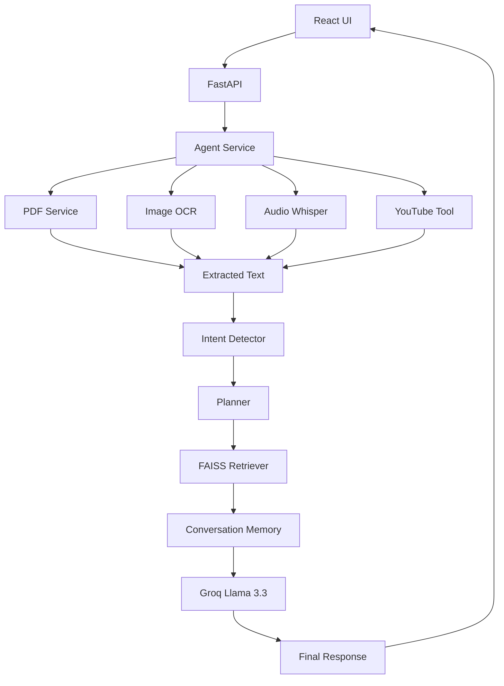

# Agentic Multi-Modal AI Assistant

An Agentic AI application that accepts multiple input types (Text, PDF, Image, Audio), extracts information, performs Retrieval-Augmented Generation (RAG), and autonomously selects the appropriate tools to answer user queries.

## Features

- Text Question Answering
- PDF Parsing
- OCR for Images (EasyOCR)
- OCR Fallback for Scanned PDFs
- Audio Transcription (Whisper)
- Multi-Document RAG using FAISS
- Persistent Vector Store
- Conversation Memory
- YouTube URL Detection and Transcript Fetching
- Agent Planning & Tool Selection
- Groq Llama 3.3 Integration
- React Chat UI
- Execution Plan Visualization
- Extracted Text Viewer

---

## Tech Stack

### Backend

- FastAPI
- Python
- Groq API (Llama 3.3 70B)
- FAISS
- Sentence Transformers
- EasyOCR
- Whisper
- PyMuPDF
- YouTube Transcript API

### Frontend

- React
- Axios
- CSS

---

## Project Structure

backend/
```
app/
├── agent/
├── config/
├── memory/
├── models/
├── rag/
├── routes/
├── services/
├── tools/
├── utils/

storage/

frontend/
src/
components/
pages/

```

---

## Workflow

1. User uploads Text / PDF / Image / Audio
2. Content is extracted
3. Agent detects user intent
4. Planner selects required tools
5. Documents are indexed into FAISS
6. Relevant chunks are retrieved
7. Groq LLM generates the final response
8. Conversation history is stored for contextual chat

---

## Supported Inputs

- Text
- PDF
- Scanned PDF
- Image (.png, .jpg, .jpeg)
- Audio (.wav, .mp3, .m4a)

---

## Implemented Agent Tasks

- Text Extraction
- OCR
- PDF Parsing
- Audio Transcription
- Multi-document Retrieval
- Conversational Question Answering
- Summarization
- YouTube Transcript Retrieval
- Persistent Knowledge Base
- Conversation Memory

---

## Installation

Clone the repository

```bash
git clone <repository-url>
cd agentic-multimodal-ai
```

Backend

```bash
cd backend

python -m venv venv

venv\Scripts\activate

pip install -r requirements.txt
```

Frontend

```bash
cd frontend

npm install

npm run dev
```

Run Backend

```bash
uvicorn app.main:app --reload
```

---

## Environment Variables

Create a `.env` file

```env
GROQ_API_KEY=your_groq_api_key
```

---

## Example Queries

### PDF

```
Summarize this PDF
```

### Image

```
Extract text from this image
```

### Audio

```
Transcribe this audio
```

### RAG

```
What are the action items in this document?
```

### YouTube

```
Summarize this YouTube video
https://www.youtube.com/watch?v=XXXXXXXXXXX
```

---

## Future Improvements

- Follow-up Question Agent
- Cross-input Reasoning
- OCR Confidence Scores
- Audio Duration Detection
- Docker Deployment
- Cloud Deployment
- Streaming Responses
- Tool Graph Visualization

---

## Author

Nandish Somanaboina

IIIT Sri City
